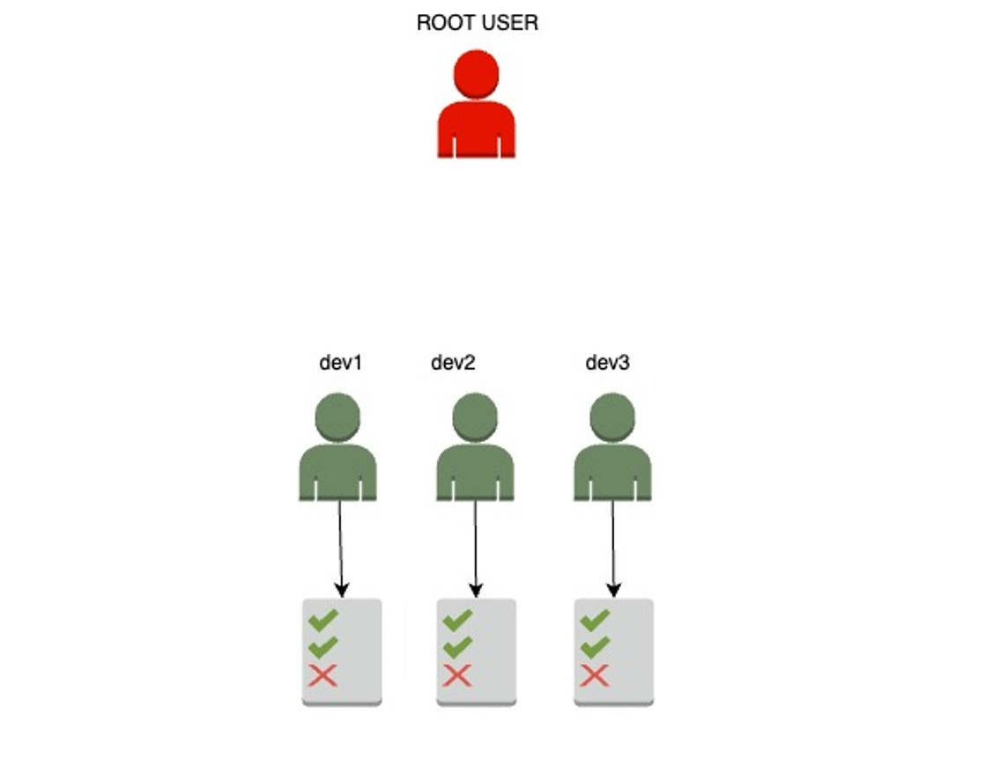
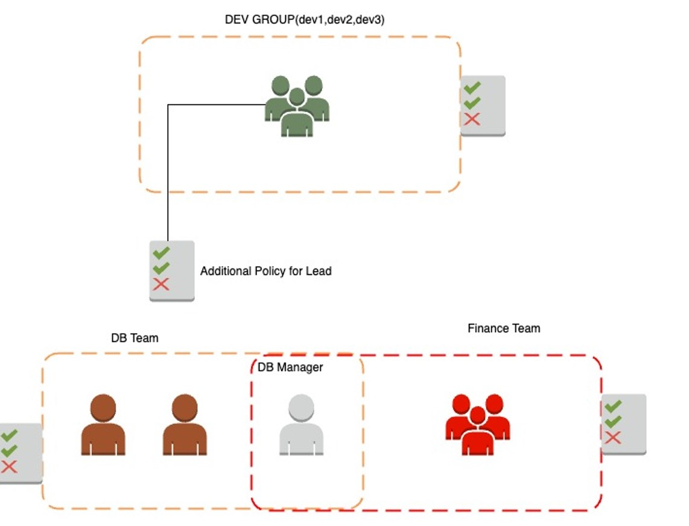
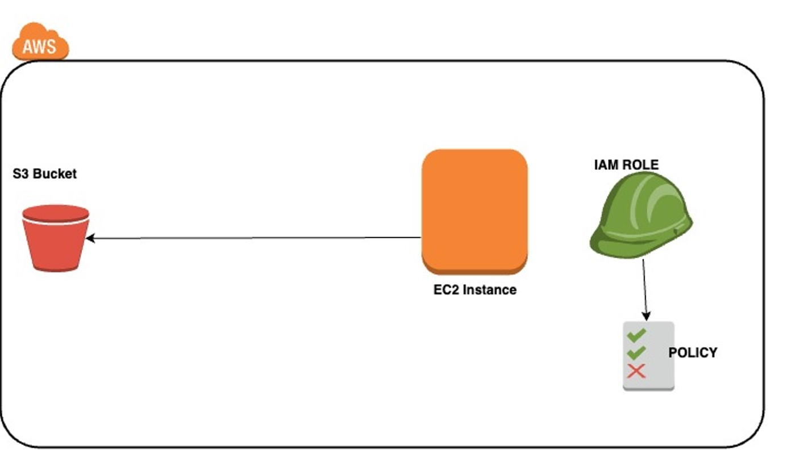
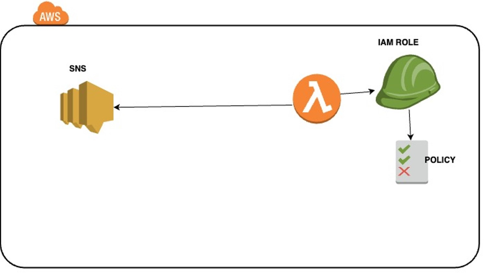

# AWS Identity and Access Management (IAM)

**IAM** (Identity and Access Management) is a **global service** in AWS that enables you to securely control access to AWS services and resources for your users. It is a **fundamental** security service in AWS that ensures users and systems have the appropriate permissions to interact with AWS resources.

### Key Components of IAM:





1. **Root Account**:
   - The **root account** is created automatically when you set up your AWS account. It is the account that has **full access** to all AWS services and resources within your account.
   - **Security Note**: The root account should **never be used** for day-to-day operations because of its unlimited permissions. Instead, you should create individual IAM users for regular tasks.
   - **Best Practice**: 
     - Enable **Multi-Factor Authentication (MFA)** for the root account to add an extra layer of security.
     - Store root account credentials securely and only use them for essential tasks, such as account setup.

2. **IAM Users**:
   - **IAM Users** are individual entities (such as employees or services) that need access to AWS resources.
   - Each IAM user can be assigned a **unique set of credentials** (username, password, and/or access keys) to log in and interact with AWS resources.
   - Users can be granted different levels of permissions depending on their roles and responsibilities within the organization.
   - **Security Tip**: Assign permissions based on the **least privilege principle**—only grant the permissions a user needs to do their job, nothing more.
  


3. **IAM Groups**:
   - **IAM Groups** allow you to organize IAM users and manage permissions collectively.
   - Groups can simplify the management of permissions. For example, you can create a "Developers" group and assign permissions needed for development tasks (such as accessing EC2 instances or S3 buckets).
   - **Key Characteristics**:
     - Groups contain only **users** and cannot contain other groups.
     - A user can be a member of **multiple groups**.
   - **Best Practice**: Use groups to assign permissions rather than assigning them to individual users directly. This makes it easier to manage permissions when users join or leave the organization.

4. **User Membership**:
   - **Users are not required to belong to a group**, though it is a best practice to group users based on their roles (e.g., Admins, Developers, Operations).
   - A single user can belong to **multiple groups** if they need access to resources across different roles or functions.

### Why Use IAM?

- **Secure Access Control**: IAM enables you to define and manage access controls across your AWS environment, ensuring that only authorized users and services can access specific resources.
- **Fine-Grained Permissions**: You can assign granular permissions, ensuring users and services only have the rights they need to complete their tasks.
- **Centralized Management**: IAM offers a centralized way to manage user permissions, credentials, and access policies, making it easier to enforce security best practices across your organization.

AWS offers different ways to manage permissions through IAM policies. These policies define what actions are allowed or denied on AWS resources. There are three main types of policies: **AWS Managed Policies**, **Custom (Customer Managed) Policies**, and **Inline Policies**.

### 1. AWS Managed Policies
**AWS Managed Policies** are pre-configured policies created and maintained by AWS. These policies are designed to provide permissions for common use cases across AWS services. AWS updates and manages these policies, ensuring they remain up to date as AWS services evolve.

#### Key Features:
- **Pre-configured** by AWS.
- **Maintained** by AWS (including updates and improvements).
- Designed for **general use cases** (e.g., AdministratorAccess, ReadOnlyAccess).
- Suitable for users who need standard access without creating custom policies.

#### Example:
- **AdministratorAccess**: Grants full access to all AWS services and resources.
- **AmazonS3ReadOnlyAccess**: Provides read-only access to S3 buckets.

### 2. Custom (Customer Managed) Policies
**Custom Policies** (also called **Customer Managed Policies**) are policies that you create and manage in your AWS account. These policies allow you to tailor permissions to the specific needs of your organization, offering a higher degree of flexibility than AWS Managed Policies.

#### Key Features:
- **Created and managed** by you (the AWS account holder).
- **Customizable** to meet specific needs and granular control.
- You are responsible for **maintaining** and **updating** the policy as services and requirements change.
- Can be reused across multiple users, roles, and groups.

#### Use Case:
- You can create a policy that gives an EC2 instance read and write access to a specific S3 bucket while restricting access to other services.

### 3. Inline Policies
**Inline Policies** are policies that are directly attached to a specific IAM user, group, or role. These policies are used for **one-to-one** relationships, meaning the policy applies only to the entity it is attached to and cannot be reused.

#### Key Features:
- **Directly embedded** in a user, group, or role.
- **Not reusable** across multiple entities.
- Useful when you need very specific permissions for a single user or resource.
- The policy is **deleted** when the entity it’s attached to is deleted.

#### Use Case:
- You might use an inline policy to give a specific user temporary access to a specific S3 bucket for a limited period.

---

## Differentiation Table: AWS Managed Policies vs Custom Policies vs Inline Policies

| Feature                        | AWS Managed Policies                | Custom (Customer Managed) Policies      | Inline Policies                          |
|---------------------------------|-------------------------------------|-----------------------------------------|------------------------------------------|
| **Created By**                  | AWS                                 | Customer (you)                          | Customer (you)                           |
| **Maintained By**               | AWS                                 | Customer (you)                          | Customer (you)                           |
| **Flexibility**                 | Limited to predefined use cases     | Highly flexible                         | Highly flexible but tied to a single entity |
| **Reusability**                 | Reusable across multiple users/roles| Reusable across multiple users/roles    | Not reusable (applies to one entity only)|
| **Common Use Case**             | General use case (e.g., Admin, S3 ReadOnly) | Custom permissions for specific needs   | Temporary or specific permissions tied to a single user or resource |
| **Updates**                     | Automatically updated by AWS        | Must be manually updated by the customer | Must be manually updated by the customer |
| **Visibility**                  | Available to all accounts           | Only visible within your AWS account    | Only visible to the specific entity it’s attached to |
| **Deletion Impact**             | Managed by AWS                      | Can be detached and managed separately  | Deleted if the attached user/role is deleted |

---

### When to Use Each Policy Type:

1. **AWS Managed Policies**: 
   - Use when you need common permissions quickly, such as **read-only** access to services or **administrator** access.
   - Ideal for users who require standard AWS access patterns without custom configurations.

2. **Custom (Customer Managed) Policies**:
   - Use when you need **granular control** over permissions that are unique to your organization’s workflows.
   - Ideal for scenarios where AWS Managed Policies don’t provide the exact permissions you need.

3. **Inline Policies**:
   - Use when you need **one-off permissions** for a specific user, role, or group.
   - Ideal for situations where temporary or highly specific permissions are needed and where you don’t plan to reuse the policy.

---

## IAM Policies Structure

An **IAM policy** is a **JSON document** that defines permissions for a user, group, or role. It specifies **who** can do **what** actions on **which** resources under **what** conditions. Policies are the building blocks of AWS security and access control. They allow fine-grained access management for AWS services and resources.

An IAM policy consists of several elements:

- **Version**: The version of the policy language being used. Always use `"2012-10-17"` for compatibility, as this is the latest stable version of the policy language.
  
- **Id**: (Optional) A unique identifier for the policy. This is often used in custom policies to keep track of specific policies.

- **Statement**: The core of the policy, which defines what actions are allowed or denied. A policy can have one or more statements.

Each **Statement** in a policy contains the following components:

- **Sid**: (Optional) A unique identifier for each individual statement. This helps distinguish between multiple statements in the same policy.

- **Effect**: Specifies whether the statement will **Allow** or **Deny** access to the resources. Typically, you grant permissions using **Allow**, and in some rare cases, explicitly deny permissions with **Deny**.

- **Principal**: Identifies **who** the policy applies to. It could be an AWS account, IAM user, or IAM role. The Principal element is generally used in **resource-based policies**, such as S3 bucket policies.

- **Action**: Lists the specific actions that are **allowed** or **denied**. These actions correspond to the operations a user can perform on a resource (e.g., `s3:PutObject` allows uploading files to an S3 bucket).

- **Resource**: Specifies the AWS resources the actions apply to. You can target specific resources (like an S3 bucket, EC2 instance, etc.) using Amazon Resource Names (ARNs), or use `*` to apply actions to all resources.

- **Condition**: (Optional) Defines the circumstances under which the policy is in effect. Conditions can be based on factors such as the time of the request, the source IP address, or whether a request is using SSL.

By combining these elements, you can create highly specific and fine-grained access control policies for AWS services.

### Example IAM Policy

Here's an example of a policy that allows specific actions on **EC2**, **Elastic Load Balancer**, and **CloudWatch**:

```json
{
  "Version": "2012-10-17",
  "Statement": [
    {
      "Effect": "Allow",
      "Action": "ec2:Describe*",
      "Resource": "*"
    },
    {
      "Effect": "Allow",
      "Action": "elasticloadbalancing:Describe*",
      "Resource": "*"
    },
    {
      "Effect": "Allow",
      "Action": [
        "cloudwatch:ListMetrics",
        "cloudwatch:GetMetricStatistics",
        "cloudwatch:Describe*"
      ],
      "Resource": "*"
    }
  ]
}
```
### Explanation of the Example Policy:

- **Effect**: All statements in this policy have an `"Allow"` effect, meaning the actions defined in the `"Action"` field are allowed for the user, group, or role associated with the policy.

- **Actions**: 
  - `"ec2:Describe*"` allows the user to perform **describe** actions on all EC2 resources (e.g., describe instances, describe security groups, etc.). The `*` wildcard indicates that all actions starting with "Describe" are allowed.
  - `"elasticloadbalancing:Describe*"` allows the user to perform **describe** actions on AWS Elastic Load Balancer resources (e.g., describe load balancers, target groups).
  - `"cloudwatch:ListMetrics"`, `"cloudwatch:GetMetricStatistics"`, and `"cloudwatch:Describe*"` allow the user to perform actions related to monitoring and retrieving metrics from CloudWatch. This is crucial for monitoring EC2 instances, load balancers, and other AWS resources.

- **Resources**: 
  - The `"Resource": "*"` statement applies these actions to **all resources** within the relevant AWS service. In production environments, it’s a best practice to replace `*` with more specific resource ARNs (Amazon Resource Names) to restrict permissions to specific resources.

## IAM Password Policy

A **strong password policy** is critical for securing access to your AWS environment. It reduces the likelihood of unauthorized access by enforcing specific security requirements for IAM user passwords. A good password policy ensures that passwords are difficult to guess and are regularly changed.

### Key Features of a Strong Password Policy:

- **Minimum Password Length**: 
  - Enforce a minimum length for passwords to ensure they are harder to crack. AWS recommends setting a minimum of 8 characters, but higher is always better (e.g., 12–16 characters).
  
- **Character Types**: 
  - Require the use of different character types:
    - **Uppercase letters** (A-Z)
    - **Lowercase letters** (a-z)
    - **Numbers** (0-9)
    - **Non-alphanumeric characters** (e.g., `@`, `#`, `$`, `!`)
  - These variations make the password harder to predict and increase security.

- **Allow Password Change**: 
  - Ensure IAM users can change their own passwords when needed, such as when they suspect that their credentials have been compromised.
  
- **Password Expiration**: 
  - Set a rule to require users to change their passwords periodically (e.g., every 90 days) to limit exposure to stolen credentials.
  
- **Prevent Password Reuse**: 
  - Enforce password history rules to prevent users from reusing their old passwords, which can reduce the effectiveness of password expiration policies.

## Multi-Factor Authentication (MFA)

**MFA** adds an extra layer of security beyond just using a password. It requires two forms of authentication:
1. **Something you know** (your password).
2. **Something you have** (a physical security token or an authenticator app like Google Authenticator).

MFA helps protect against unauthorized access to your AWS resources, even if the password is compromised. AWS strongly recommends enabling MFA for your **root account** and all IAM users with access to sensitive resources.

### Key Benefits of MFA:
- **Protection against compromised credentials**: If a user’s password is stolen or guessed, the attacker would still need the MFA device to log in.
- **MFA for the root account**: The root account has access to all AWS resources and configurations, so enabling MFA for this account is crucial for securing your entire AWS account.

## Accessing AWS as an IAM User

AWS provides **multiple ways** for users to access and interact with its services:

### 1. AWS Management Console:
   - The **Management Console** is the web-based interface where users can log in with a **username**, **password**, and optionally, **MFA**.
   - It provides a visual interface for managing AWS resources.

### 2. AWS Command Line Interface (CLI):
   - The **CLI** allows users to interact with AWS services by typing commands in a command-line shell (e.g., Bash, PowerShell, or Windows Command Prompt).
   - CLI access is protected by **Access Keys**.
   - CLI is useful for automation, scripting, and managing AWS resources programmatically.

### 3. AWS Software Developer Kit (SDK):
   - The **SDK** allows developers to integrate AWS services into their applications using popular programming languages such as Python, JavaScript, Java, .NET, and more.
   - SDK access is also protected by **Access Keys**.

### Access Keys for CLI and SDK:
- **Access Keys** provide programmatic access to AWS. They consist of two components:
  - **Access Key ID**: This acts like a username.
  - **Secret Access Key**: This acts like a password.
  
- Access Keys should be treated like passwords — they are sensitive credentials and should **never be shared**.

## AWS CLI (Command Line Interface)

The **AWS CLI** is a powerful tool that enables you to manage AWS services directly from your terminal or command prompt. It provides direct access to the **public APIs** of AWS services, allowing you to create scripts to automate the management of your infrastructure.

### Key Benefits of AWS CLI:
- **Scripting & Automation**: You can use the CLI to automate routine tasks like creating EC2 instances, managing S3 buckets, or deploying CloudFormation stacks.
- **Open Source**: The CLI is open-source and can be found on [GitHub](https://github.com/aws/aws-cli).
- **Alternative to Management Console**: It’s a preferred tool for DevOps teams and users who need quick and efficient management of AWS resources without using the web-based console.



## IAM Roles for AWS Services

Certain AWS services need to perform actions on your behalf. For instance, an **EC2 instance** might need permission to read from an S3 bucket, or a **Lambda function** may need access to a DynamoDB table.

Instead of embedding long-term credentials in your application, you assign an **IAM Role** to the service. The IAM role defines what actions the service is allowed to perform, and AWS manages the short-term credentials for the role.



### Common IAM Roles:
- **EC2 Instance Roles**: This role is assigned to EC2 instances to allow them to interact with other AWS services without hardcoding credentials in the instance. For example, an EC2 instance with a role can automatically access S3, DynamoDB, etc.
  
- **Lambda Function Roles**: These roles allow Lambda functions to access other AWS services. For example, a Lambda function may need to write logs to CloudWatch or interact with other AWS services like RDS or SQS.

- **CloudFormation Roles**: CloudFormation uses roles to manage resources when creating, updating, or deleting AWS resources as part of a CloudFormation stack.

## IAM Best Practices & Guidelines

AWS provides several **best practices** for managing IAM securely and efficiently. These guidelines help you secure your AWS resources and manage access control effectively:

1. **Avoid Using the Root Account**:
   - The **root account** has unrestricted access to all AWS services and should only be used for the initial account setup. Always create **IAM users** for day-to-day tasks.

2. **Follow the Principle of Least Privilege**:
   - Grant users only the permissions they need to perform their job. This minimizes the risk of unauthorized access or accidental changes to your environment.

3. **Use Groups to Assign Permissions**:
   - Instead of assigning permissions to individual users, create **IAM Groups** (e.g., Admins, Developers, Operations) and assign permissions to the group. Add users to groups as needed, making permission management easier and scalable.

4. **Implement a Strong Password Policy**:
   - Ensure that your password policy enforces a minimum length, character complexity, and regular password rotations.

5. **Enable Multi-Factor Authentication (MFA)**:
   - Enable MFA for all users, especially those with elevated privileges, such as administrators or users with access to sensitive data.

6. **Use IAM Roles for Services**:
   - Use **IAM Roles** to assign permissions to AWS services like EC2 or Lambda, rather than embedding long-term credentials into the services.

7. **Rotate Access Keys Regularly**:
   - For programmatic access, ensure that **Access Keys** are rotated regularly. Avoid using long-lived credentials.

8. **Monitor and Audit Permissions**:
   - Regularly audit user permissions using **IAM Credentials Report** and **IAM Access Advisor** to ensure users have only the permissions they need.
   
9. **Never Share Access Keys or Credentials**:
   - IAM user credentials and Access Keys should never be shared. Each user should have their own credentials to ensure accountability and security.

By following these best practices, you can ensure that your AWS environment is secure, scalable, and easy to manage.


## TASKS & Interview Questions
1) . Create IAM user and assign aws managed Permissions
2) . Create a custom policy and attach to the user.
3) . Attach a readonly permission to a User
4) . Add a deny statement for the above created policy and attach to user and try to access the service
5) . create a role
6) . Attach a policy to role
7) . Create access_key and secret_key for users and configure in your local machine.
8) . Ability to Explain why should we use IAM Roles instead of access_keys in AWS environment.
9) . Ability to explain difference between IAM role and IAM User
10) . what are the different types of policies available in IAM
11) . what happens to the inline policy granted to the user, if the user is deleted.
12) . Is there a way to force user to rotate his console credentials? if yes/No how/why?
    
