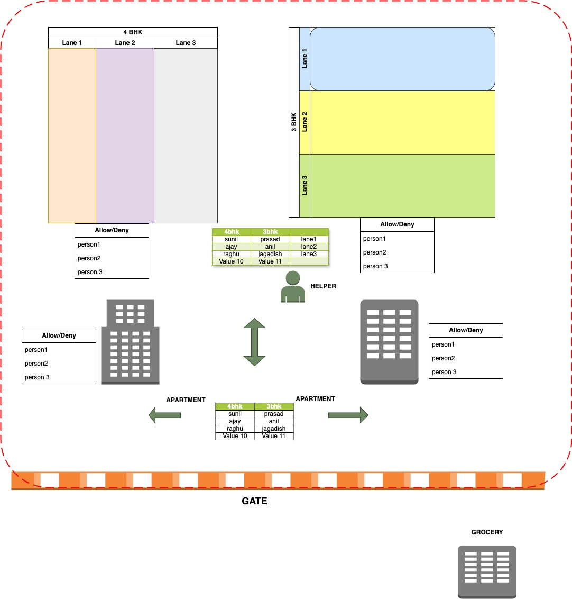

# Gated Community Design

## 1. Gated Community Overview
Imagine a **gated community** as our **VPC (Virtual Private Cloud)**. This community is a secure area within the larger city (the AWS cloud).  
Inside this gated community, we have different types of housing:
- **Villas (Private Subnet)**: Private and exclusive homes where residents value privacy.
- **Apartments (Public Subnet)**: More accessible housing where guests can come and go easily.

This gated community has **controlled entry and exit points** to ensure security and proper management of residents and guests.

---

## 2. Villas (Private Subnets)
The **villas** represent the **private subnet** in our community. The residents of these villas are **very private** and do not like outsiders coming directly to their homes.  
- Villas are **secure** and **not directly visible** to outsiders from the city (internet). They need a **trusted mediator** to interact with the outside world (explained later as the **NAT Gateway**).  
- Examples of residents in these villas could be:
  - Databases (like RDS)
  - Backend servers that do not need direct access from outside the gated community.

---

## 3. Apartments (Public Subnets)
The **apartments** in the gated community represent the **public subnet**.  
- These apartments are **accessible to guests** from outside the community. This means that people (internet traffic) can visit these apartments directly through the **main gate**.
- These apartments are great for services that need to be visible to the outside world, like:
  - Web servers (EC2 instances hosting websites)
  - Load balancers that distribute traffic.

---

## 4. Main Gate (Internet Gateway - IGW)
The **main gate** of our gated community is the **Internet Gateway (IGW)**.  
- The main gate controls the **entry and exit** of people (data) between the community and the city (internet).  
- Without the main gate, no one from outside the gated community can visit the **apartments** or communicate with them.

---

## 5. Helper Service (NAT Gateway)
Think of the **NAT Gateway** as a **trusted helper** or **messenger** who lives in the **apartments (public subnet)**.  
- Residents of the **villas (private subnet)** rely on this helper to **fetch groceries**, **send letters**, or **order food** (access the internet).  
- The **NAT Gateway** listens to the requests from villa residents, goes outside through the **main gate (IGW)** to fulfill those requests, and then **brings back the results** to the villas.  
- This way, the **villas** maintain their privacy, as the NAT Gateway **hides their identity** when interacting with the outside world.

---

## 6. Streets in the Villas (1A, 2A) - Route Segments
Within the **villas (private subnet)**, there are **streets** like **1A**, **2A**, etc. Each of these streets represents a **subdivision** of the villa area.  
- Think of **1A** and **2A** as specific segments or lanes where different residents live.  
- For example:
  - **Villas on Street 1A** might have some backend servers.
  - **Villas on Street 2A** could host different databases.
- Each street has its own designated **address range (IP address range)** that identifies which part of the community it belongs to.

---

## 7. Route Table - The Community Map
The **Route Table** is like a **map** that everyone in the community uses to understand how to reach different places, both inside and outside.  
- It contains **instructions (routes)** on how to get to the **main gate (IGW)** or how to reach the **NAT Gateway**.
- For example:
  - The **villas** might have a route that says, “To access the city, first ask the **NAT Gateway** for help.”
  - The **apartments** might have a route that says, “You can go directly through the **main gate**.”

---

## 8. Putting It All Together
Imagine you live in **Street 1A** in a **villa**. You want to **order food online**, but since your villa is private, you ask your **trusted helper (NAT Gateway)** to place the order for you. The helper lives in an **apartment (public subnet)** and has access to the **main gate (IGW)**. He places the order, picks it up, and brings it back to you while ensuring your villa’s privacy.

Meanwhile, someone from outside the community wants to **visit a website** hosted in one of the **apartments**. They enter through the **main gate (IGW)** and reach the apartment directly since it is publicly accessible.

The **Route Table** helps direct everyone in the community, making sure that:
- The **villas** use the **NAT Gateway** when they need to interact with the outside world.
- The **apartments** communicate directly through the **main gate**.

---
