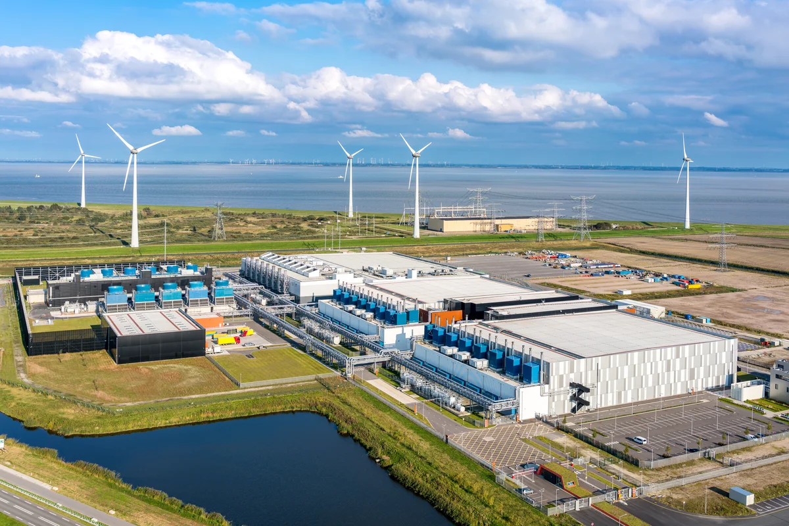
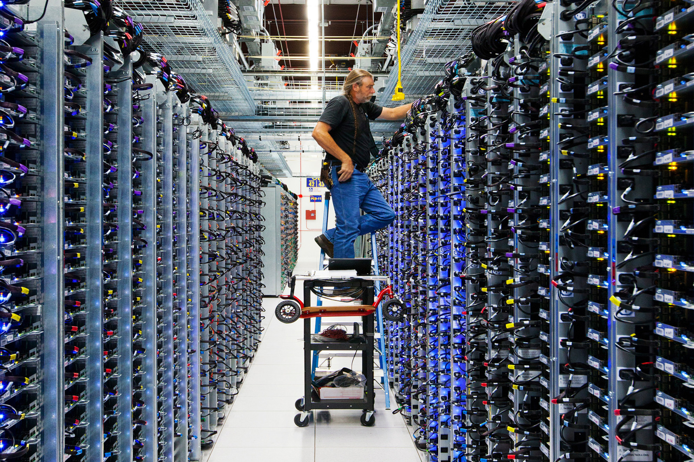
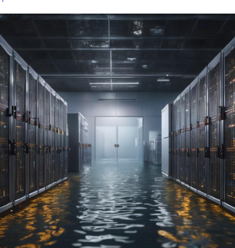
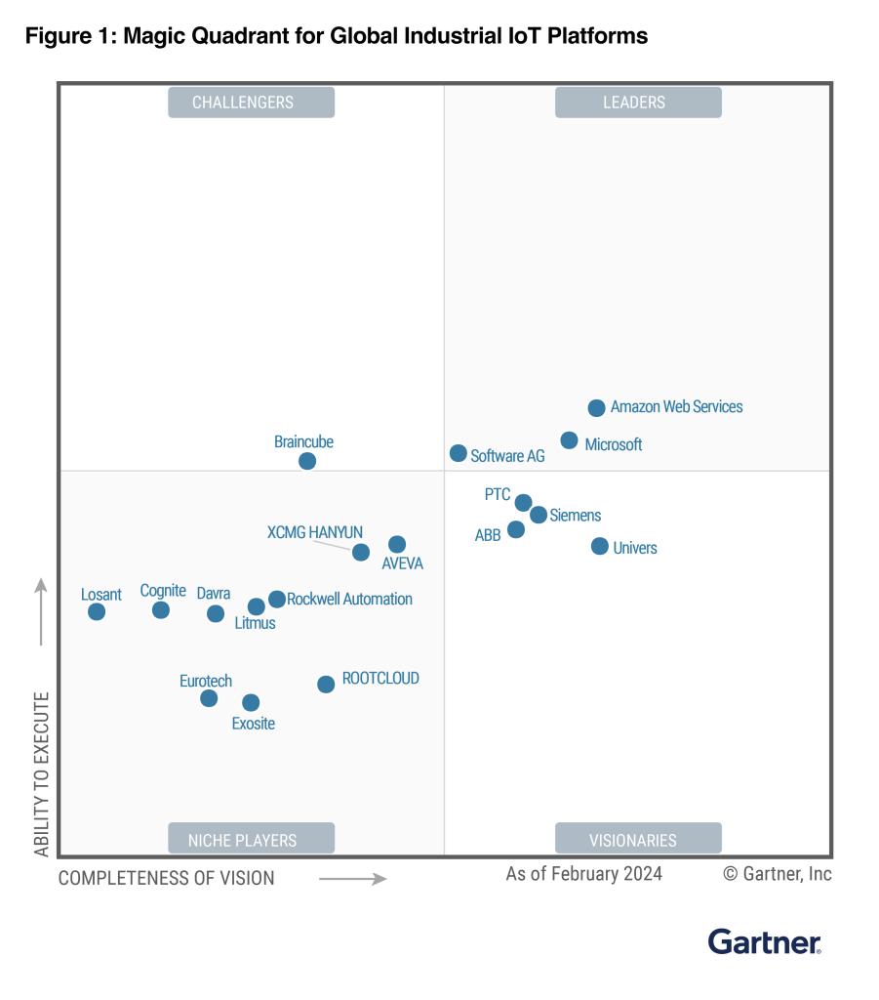
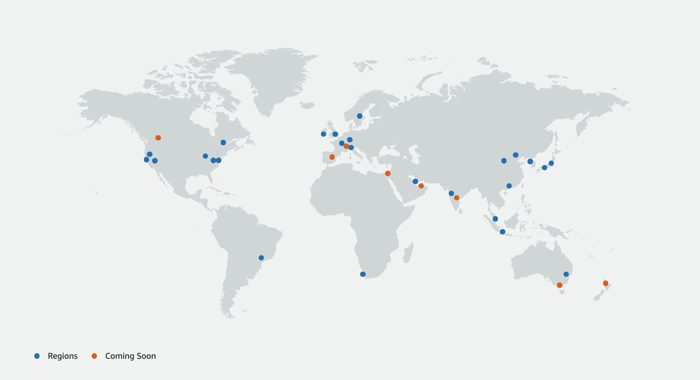

# Introduction to Cloud Computing:

## Scenario: Running an E-Commerce Application with Traditional Servers

Imagine you have an e-commerce business. You decide to host your application on physical servers that you purchase and manage yourself. Let’s look at what’s required to keep your servers running smoothly:

### Managing Traditional Servers

- **Real Estate**: You need space to store your servers. It could be a dedicated room or an entire data center, depending on your needs.
- **Power Supply**: Servers require a continuous power supply. You might need backup generators to ensure your servers stay up during power outages.
- **Cooling Systems**: Servers generate a lot of heat. Cooling systems are necessary to keep them running efficiently and avoid overheating.
- **Security**: Physical security is crucial to prevent unauthorized access to your servers. You may need staff to monitor access or install security systems.
- **IT Staff**: Skilled professionals are needed to maintain, update, and troubleshoot server issues, ensuring everything runs smoothly.

Now, let’s say you have a **FESTIVE SALE** coming up, like BIg Billion Sale. Your servers must handle a surge in traffic as customers flood your site to make purchases.

### Challenges of Scaling with Traditional Servers

- **Capacity Planning**: To prepare for increased traffic, you’ll need to buy more servers. But how many should you buy? Predicting the right amount of capacity is difficult.
- **Cost**: Servers are expensive, and you need to purchase them upfront. You may end up buying more servers than you actually need.
- **What Happens After the Sale?** Once the sale is over, traffic returns to normal levels. Now, you’re left with extra servers sitting idle, consuming power and requiring maintenance, but not generating value. This is **wasted investment**.

### Unpredictable Situations

What if something unexpected happens, like a **power outage** or a **flood** in your data center? Your entire application could go offline, resulting in **lost sales** and a **damaged reputation**. Recovering from such incidents is time-consuming and costly, especially if you don’t have a disaster recovery plan in place.

## Introducing the Solution: Cloud Computing

Now, let’s look at how **cloud computing** solves these problems. The cloud allows you to rent servers and resources on demand instead of owning and maintaining physical servers. Here’s how it helps:

### Benefits of Cloud Computing

- **No More Data Center Management**: You don’t have to worry about maintaining physical servers, power, cooling, or security. The cloud provider handles all of this for you.
- **Scalability on Demand**: With cloud services, you can easily scale up your server capacity when traffic increases and scale down when it decreases. For example, during your big sale, you can add more servers quickly to handle the surge, and once the sale ends, you can reduce the number of servers, paying only for what you used.
- **Global Reach**: Cloud providers have data centers all over the world. This means you can deploy your application closer to your users, reducing latency and providing a faster experience for your customers, no matter where they are.
- **Cost Efficiency**: With cloud computing, you pay for what you use. There’s no need for large upfront investments in hardware. You can start small and expand as your business grows.
- **Disaster Recovery & High Availability**: Cloud providers offer solutions like **automated backups**, **geo-redundancy**, and **disaster recovery**. If there’s a problem in one data center, your application can automatically switch to another, keeping your business online.
- **Innovation & Flexibility**: Cloud services allow you to experiment with new technologies and services quickly, without the need for complex hardware setups. Want to integrate AI or data analytics? The cloud offers pre-built tools and services to do this without needing to set up new infrastructure.

### Cloud Leaders: AWS and the Gartner Magic Quadrant

Amazon Web Services (AWS) is a leader in cloud computing, providing a comprehensive suite of services that power millions of businesses globally. According to the **Gartner Magic Quadrant for Cloud Infrastructure and Platform Services (CIPS)**, AWS has consistently been positioned as a **Leader** due to its rich feature set, global reach, and continuous innovation.

- **Why is AWS a Leader?**
  - **Market Share**: AWS holds a significant portion of the cloud market, making it a go-to provider for businesses of all sizes.
  - **Breadth of Services**: AWS offers over **200 services**, ranging from compute and storage to machine learning, analytics, and IoT.
  - **Innovation**: AWS continually launches new services and updates, maintaining its competitive edge in the cloud industry.

### Global Infrastructure of AWS

One of AWS's key strengths is its **global infrastructure**, allowing businesses to operate at a global scale with high availability and low latency.

- **Regions and Availability Zones (AZs)**:
  - AWS divides its global infrastructure into **Regions**, which are separate geographic areas, each containing multiple **Availability Zones**.
  - An **Availability Zone (AZ)** is a distinct data center within a Region. Multiple AZs within a Region are connected via low-latency links, enabling customers to design fault-tolerant applications.
  - As of now, AWS has **over 30 Regions** with **90+ Availability Zones** worldwide, and more are being added to expand AWS’s global footprint.

- **Why is this Important?**
  - **Redundancy**: With multiple AZs in each Region, AWS provides **high availability** by allowing you to deploy resources in different data centers within a single Region.
  - **Geographical Reach**: AWS’s global presence means you can deploy your applications close to your customers, providing faster response times and a better user experience.

### Service Level Agreement (SLA) for AWS EC2

One of the key benefits of using AWS is the **Service Level Agreement (SLA)** provided for **Amazon EC2 (Elastic Compute Cloud)** instances, which guarantees a high level of availability:

- **AWS EC2 SLA**: AWS guarantees a **99.99% uptime** for Amazon EC2 instances within a **Region** over a monthly billing cycle. This means AWS aims to ensure that your instances are running and accessible for the vast majority of time, minimizing downtime.
- If AWS does not meet this SLA, customers may be eligible for **service credits**, which can offset costs in case of downtime.
- **What does 99.99% mean?** It translates to a potential downtime of about **4.38 minutes per month**. This high availability means that even in rare cases of service interruption, the impact on your application is minimized.

The high availability and global presence of AWS’s infrastructure ensure that your business can maintain **continuous operations**, even during unexpected situations like hardware failures or natural disasters.

### Comparing On-Premises vs. Cloud

| **Feature**                 | **On-Premises**                            | **Cloud**                                       |
|-----------------------------|---------------------------------------------|-------------------------------------------------|
| **Cost Structure**          | High upfront costs for hardware and setup  | Pay-as-you-go, reducing initial expenses        |
| **Scalability**             | Manual, time-consuming, costly             | Instant scaling based on demand                 |
| **Maintenance**             | Requires dedicated IT staff                | Managed by the cloud provider                   |
| **Disaster Recovery**       | Requires a separate backup strategy        | Built-in redundancy and recovery solutions      |
| **Geographical Reach**      | Limited to your data center location       | Global presence with low-latency options        |
| **Time to Market**          | Slow, with complex setup                   | Fast, enabling rapid deployment and updates     |
| **Availability Guarantee**  | Dependent on local infrastructure          | 99.99% SLA-backed availability (AWS EC2)        |

# Course Topics

- **IAM (Identity and Access Management)**: Manage access to AWS resources with secure, fine-grained permissions.
- **VPC (Virtual Private Cloud)**: Create isolated networks within the AWS cloud for your resources.
- **EC2 (Elastic Compute Cloud)**: Scalable virtual servers in the cloud for running applications.
- **Auto Scaling**: Automatically adjust the number of EC2 instances to meet demand.
- **Load Balancer**: Distribute incoming application traffic across multiple targets for high availability.
- **S3 (Simple Storage Service)**: Secure, durable, and scalable object storage for files and backups.
- **Lambda**: Run code without provisioning or managing servers with event-driven computing.
- **SNS (Simple Notification Service)**: Send push notifications or emails to subscribers using a messaging service.
- **SQS (Simple Queue Service)**: Decouple and manage messaging queues between distributed systems.
- **KMS (Key Management Service)**: Create and control encryption keys to secure your data.
- **RDS (Relational Database Service)**: Managed databases like MySQL, PostgreSQL, and SQL Server.
- **Aurora**: A high-performance, scalable relational database compatible with MySQL and PostgreSQL.
- **CloudFront**: A global content delivery network (CDN) to deliver content with low latency.
- **API Gateway**: Create, publish, and manage secure RESTful and WebSocket APIs.
- **CloudWatch**: Monitor AWS resources and applications with metrics and logs.
- **CloudWatch Logs**: Store, access, and search log data from AWS services and custom applications.
- **Alerts**: Set up alarms to get notified when metrics exceed specified thresholds.
- **AWS Secrets Manager**: Securely store and manage sensitive information like API keys and passwords.
- **Kinesis**: Process and analyze real-time streaming data for analytics and insights.
- **Transit Gateway**: Connect multiple VPCs and on-premises networks through a central hub.
- **VPC Peering**: Establish secure connections between VPCs for private communication.
- **Athena**: Query data in S3 using standard SQL without needing a database server.

