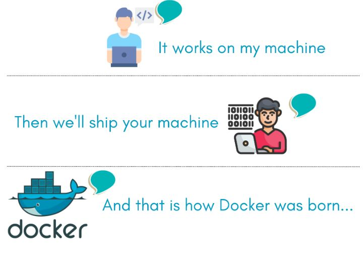
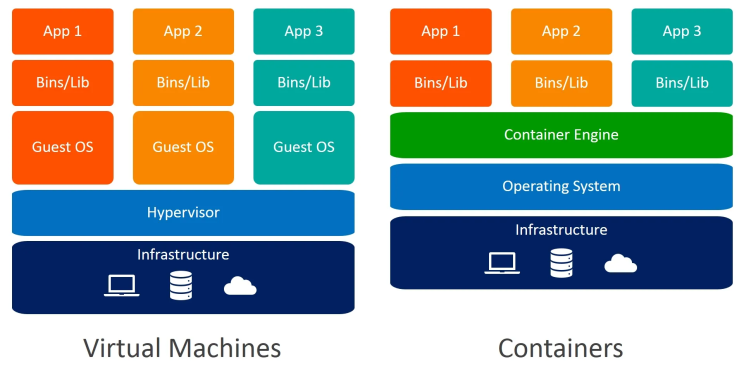
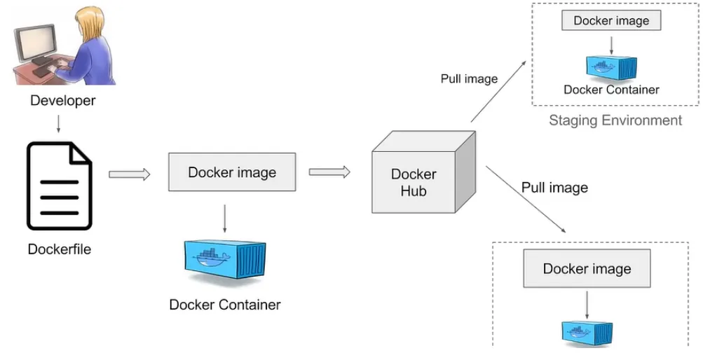

### Why Docker
Imagine you've developed an application that works flawlessly on your machine. When you share it with a colleague, they run into issues because their environment is different—different libraries, dependencies, or configurations. What if you could package your entire application, along with all its dependencies and settings, into a single unit that your colleague can run on their system without any compatibility problems? That's essentially what Docker allows you to do.


## Virtual Machine Vs Containers



### What is Hypervisor
A hypervisor, also known as a virtual machine monitor or VMM, is software that creates and runs virtual machines (VMs). A hypervisor allows one host computer to support multiple guest VMs by virtually sharing its resources, such as memory and processing.


| Aspect              | Virtual Machines (VMs)                                   | Containers                                       |
|---------------------|----------------------------------------------------------|--------------------------------------------------|
| **Architecture**    | Includes the entire guest operating system               | Shares the host operating system's kernel        |
| **Resource Usage**  | Heavyweight; requires more memory and storage            | Lightweight; uses less memory and storage        |
| **Isolation**       | Full isolation with separate OS instances                | Isolated processes within the same OS            |
| **Performance**     | Slower startup and performance due to full OS            | Faster startup and performance                   |
| **Size**            | Larger size (usually in gigabytes)                       | Smaller size (often in megabytes)                |
| **Boot Time**       | Takes minutes to start                                   | Starts in seconds                                |
| **Portability**     | Less portable; depends on hypervisor and hardware        | Highly portable across different environments    |
| **Use Cases**       | Running multiple operating systems on one machine        | Deploying microservices and scalable apps        |
| **Management**      | More complex to set up and maintain                      | Easier to manage with tools like Docker          |
| **Security**        | Strong isolation provides better security                | Shares kernel; requires careful security measures |

## Architecture of Docker


## Docker Installation on Amazon Linux 2

  - ```bash
     sudo su
     yum update -y
     yum install docker -y
     systemctl enable docker
     systemctl status docker
     ```

Now you have all the docker components installed on your machine. you are ready to go!!

## Let's Run an Nginx Container

So, you might be thinking, "Let's run an Nginx container." But how do we actually do that?

## How Do I Run It?

To run an Nginx container, we use the `docker run` command. Open your terminal and type:

```bash
docker run nginx
```

## **What Happened in the background?**

Docker Pulled something called as Image.

### What Is a Docker Image?

A Docker image is a lightweight, stand-alone package that includes everything needed to run a piece of software:

- **Code**: The application code you want to run.
- **Runtime**: The necessary runtime or interpreter (e.g., Node.js, Python).
- **Libraries**: All required system libraries and dependencies.
- **Environment Variables**: Configuration settings.
- **Files**: Any additional files or assets.

### Where Is It Picked From?

When you run `docker run nginx`, Docker looks for the `nginx` image locally on your machine:

- **Local Check**: Docker first checks if the image exists in your local image repository.
- **Docker Hub**: If not found locally, Docker pulls the image from [Docker Hub](https://hub.docker.com/), a public registry with millions of images.

### That is Great!! I am finally running my Nginx Container

But I am seeing something like this on my terminal
```
2024/09/17 16:02:34 [notice] 1#1: using the "epoll" event method
2024/09/17 16:02:34 [notice] 1#1: nginx/1.27.1
2024/09/17 16:02:34 [notice] 1#1: built by gcc 12.2.0 (Debian 12.2.0-14) 
2024/09/17 16:02:34 [notice] 1#1: OS: Linux 5.10.224-212.876.amzn2.x86_64
2024/09/17 16:02:34 [notice] 1#1: getrlimit(RLIMIT_NOFILE): 32768:65536
2024/09/17 16:02:34 [notice] 1#1: start worker processes
2024/09/17 16:02:34 [notice] 1#1: start worker process 29
```
Seems like it is running the foreground, I think it should be running in the background, Because i have other work to be done on my terminal.

### Detached Mode in Docker

When running containers, you can choose to run them in the foreground or in the background. Running a container in **detached mode** means it runs in the background of your terminal.

- **Detached Mode (`-d`)**:
  - Using the `-d` flag with `docker run` starts the container in detached mode.
  - The container runs in the background, and you get back to your command prompt.
  - This is useful for running applications that need to stay up without tying up your terminal.

**Example:**

```bash
docker run -d nginx
```
## Great! I Am Able to Run Nginx

Great! I have successfully run the Nginx container. I can't wait to access it. But how do I access it?

### How Do I Access It?

Since my Docker is running on an **EC2 instance**, I can use the IP address of my EC2 instance to access Nginx. I'll use port **80** as well, so I should be able to access the Nginx server directly.

## Oops! 😅 I'm Not Able to Access Nginx Using Port 80 and EC2 Public IP

Oops! 😅 I am not able to access Nginx by using port **80** and my EC2 public IP address. Is there any issue? Let me check if the container is running or not.

### But How Do I Check?

Is there any command to check if my Docker container is running? Yes! We can use the `docker ps` command.

### Explaining `docker ps`

The `docker ps` command is used to list all the running Docker containers on your system.

- **Basic Command:**

  ```bash
  docker ps
  ```
### Hmm.. COntainer is running absloutely fine, what could be the Issue? Am I missing Something? 🤔

YES, 

## Understanding Port Mapping in Docker 🛳️🔌

When running Docker containers, you might want to make the services inside the container accessible to the outside world or your host machine. This is where **port mapping** comes into play.

### What Is Port Mapping? 🌐➡️🌐

Port mapping allows you to forward a port from your host machine (or EC2 instance) to a port inside the Docker container. This way, you can access services running inside the container via the host's IP address and specified port.

### How Does Port Mapping Work?

- **Containers Have Their Own Network Stack:**
  - Each Docker container runs in its own isolated environment with its own network stack.
  - By default, services inside the container are not accessible from the host machine.

- **Exposing Ports:**
  - To make a service accessible, you need to expose the container's port to the host.
  - This is done using the `-p` or `--publish` flag with `docker run`.

### Syntax of Port Mapping

```bash
docker run -p [host_port]:[container_port] [image_name]
```

## Great! 🎉 Now I Am Able to See My Container from the Browser

## Logging into a Docker Container 🔑

Now, I want to log into my container. How do I do it? Is there any command?

### Using `docker exec` to Access a Running Container

Yes! You can use the `docker exec` command to run commands inside a running container. To get a shell inside your container, you can use:

```bash
docker exec -it <container_id> /bin/bash
```

### What Are `-i` and `-t` Options?

- **`-i`**: Keeps STDIN open even if not attached.
  - **Interactive Mode**: Allows you to interact with the container's shell.
- **`-t`**: Allocates a terminal.
  - **TTY**: Provides a terminal interface within the container.

When combined as `-it`, these options allow you to have an interactive shell session inside the container.

## Let me create a sample file as I have logged in

`touch sample.txt`

## Stopping the Container 🛑

I'm done with my work, so let me stop the container. Do I have some commands for that?

### How Do I Stop the Container?

Let's try the `docker stop` command.

But how do I get the running container list? Oh, I have `docker ps`.

```bash
docker ps
```

This command lists all the running containers.

Now, let's stop the container:

```bash
docker stop <container_id>
```

Replace `<container_id>` with the actual ID of your container from the `docker ps` output.

Cool! 😎 Everything is down.

### Checking All Containers 🔍

Wait, can you check `docker ps -a`?

```bash
docker ps -a
```

Oh... I see my container is still there. But I stopped it. How do I remove it?

### Removing the Container 🗑️
We can use the docker rm command to remove the container:

```bash
docker rm <container_id>
Again, replace <container_id> with the actual ID of your container.
```

### **What Is the Difference Between stop vs rm? 🤔**
- **docker stop**: Stops a running container. The container still exists on your system but is not running.
- **docker rm**: Removes a container from your system entirely. This deletes the container whether it's running or stopped. Use `-f` option to remove forcefully.

## Disk Space Running Low? 🛑💾

Seems like my disk is running out of space. What could be the issue?

### Is Docker Using Up Disk Space?

I've been working with Docker these days. Is it taking up my disk space? Let's check.

### Checking Docker Images 🐳🖼️

To see all the Docker images stored on your system, use:

```bash
docker images
```
This command lists all the Docker images you've downloaded or built.

## Removing Unused Docker Images 🗑️

If you need to remove images to free up space, you can use:

```bash
docker rmi <image_id>
```
Replace `<image_id>` with the actual ID of the image you want to remove.

## What Are Dangling Images? 🤔

Dangling images are layers that have no relationship to any tagged images. They are intermediate images that are no longer used and can consume disk space.

You can view dangling images with:

```bash
docker images -f "dangling=true"
```
## Cleaning Up with docker image prune 🧹
To remove all dangling images:

```bash
docker image prune
```

This command removes all dangling images to free up space.

## What Is docker system prune?
For a more thorough cleanup, you can use:

```bash

docker system prune
```

This command will remove:

All stopped containers
All dangling images
All unused networks
Add the -a flag to remove all unused images (not just dangling ones):

```
docker system prune -a
```

## Why Can't I Delete an Image Used by a Running Container?
You may encounter an error when trying to remove an image that's being used by a running container.

**Reason**: Docker prevents you from deleting images that are in use to avoid breaking running containers.

**Solution**: Stop and remove the running containers first.

## what Happened to the sample.txt file which I have created?🤔

As the Container is Terminated, the file which was created is also lost.

## Is there a way to store my files even if Container goes down?
## Understanding Docker Volumes 📦

When working with Docker containers, you might need to persist data or share data between the host and the containers. This is where **Docker volumes** come into play.

### What Are Docker Volumes? 🧐

Docker volumes are a way to store data used by containers outside of the container's filesystem. Volumes are stored on the host filesystem and are managed by Docker.

- **Persistent Storage**: Volumes allow data to persist even after the container is stopped or removed.
- **Data Sharing**: Volumes can be shared between multiple containers.
- **Decoupled Data**: They decouple the data from the container's lifecycle.

### Types of Docker Volumes

There are mainly two ways to manage data in Docker:

1. **Volumes**: Managed by Docker, stored in Docker's directory on the host.
2. **Bind Mounts**: Use any directory on the host system.

### Using Volumes 📖

#### Creating and Using a Volume

You can create a volume using the `docker volume create` command:

```bash
docker volume create my-volume
```
To use the volume with a container:
```
docker run -d -v my-volume:/opt/data nginx
```
- `-v my-volume:/opt/data`: Mounts the volume my-volume to the container's /opt/data directory.

### Using Bind Mounts 🔗

Bind mounts allow you to mount a file or directory from the host machine into a container.

#### Example:

```bash
docker run -d -v /host/path:/container/path nginx
```
- **`/host/path`**: The path on the host machine.
- **`/container/path`**: The path inside the container.

### When to Use Bind Mounts?

- When you need to access host files inside the container.
- Useful for development environments where you want the container to reflect code changes immediately.

### Managing Volumes 🛠️
## Removing Unused Volumes
To remove a volume:
```
docker volume rm my-volume
```

To remove all unused volumes:
```
docker volume prune
```

## Viewing Container Information 🧐

I want to know more about the container info. What options do I have?

### Using `docker inspect` to Get Detailed Container Information

We have the `docker inspect` option, which gives you detailed information about your container.

#### What Is `docker inspect`?

- **`docker inspect`**: This command returns low-level information on Docker objects, such as containers, images, volumes, networks, and more, in JSON format.

#### Syntax:

```bash
docker inspect [OPTIONS] NAME|ID [NAME|ID...]

Eg: docker inspect <container-id>
```

## Viewing Container Logs 📝

Similarly, if I want to check the logs of my container to see what's happening inside, what options do I have?

### Using `docker logs` to View Container Output

We have the `docker logs` command, which allows you to fetch the logs of a running or stopped container.

#### What Is `docker logs`?

- **`docker logs`**: This command retrieves the logs (stdout and stderr) from a container.

#### Syntax:

```bash
docker logs [OPTIONS] <container_id_or_name>
```

## Advanced Usage of `docker logs` 🛠️

I need more focus on the options in `docker logs`:

- `-f` or `--follow`
- `--tail`
- `--since`
- `--until`

Let's explore these options in detail.

### Following Logs in Real-Time with `-f` or `--follow` 👀

The `-f` or `--follow` option allows you to stream the logs of a container in real-time, similar to how `tail -f` works on Linux systems.

#### Syntax:

```bash
docker logs -f <container_id_or_name>
```
### Example with tailing logs

```bash
docker logs --tail <number_of_lines> <container_id_or_name>
Eg: docker logs --tail 10 <container-id>
```

### Filtering Logs by Time with `--since` and `--until` ⏰

The `--since` and `--until` options allow you to display logs within a specific time range.

#### `--since` Option

Shows logs generated after a given date/time.

**Syntax:**

```bash
docker logs --since <timestamp> <container_id_or_name>
docker logs --since 1h <container-id>
```

Shows logs from the last 2 hours.

### `--until` Option

Shows logs generated before a given date/time.

**Syntax:**

```bash
docker logs --until <timestamp> <container_id_or_name>
docker logs --until "2024-09-18T18:00:00" inspiring_hamilton
```


## Docker Workflow


